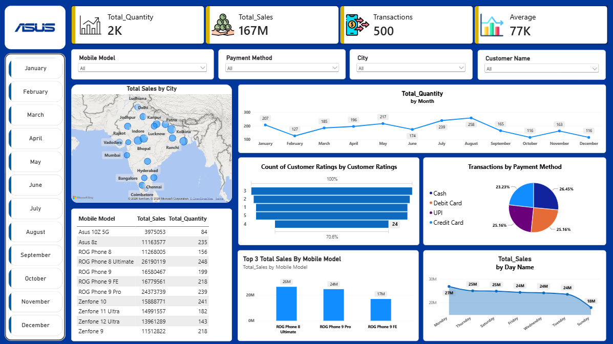

# 📱 Asus Mobile Sales Analysis Dashboard (Power BI)

An interactive Power BI dashboard that analyses Asus smartphone sales across India, covering revenue, units sold, city-wise performance, payment behaviour, customer ratings and time-based trends.



---

## 🎯 Project Objective

To turn raw transaction-level sales data into a clear, filterable dashboard that helps a business team quickly answer:

- How much revenue and volume are we generating?
- Which mobile models and cities drive the most sales?
- How do customers prefer to pay?
- Which months and weekdays are strongest or weakest?
- How satisfied are customers (ratings)?

---

## 📊 Key Metrics (KPIs)

| Metric | Value |
|---|---|
| Total Quantity Sold | ~2K units (2,163) |
| Total Sales | ~₹167M |
| Transactions | 500 |
| Average (sales per unit) | ~₹77K |

---

## 🗂️ Dataset

**File:** `Asus_Mobile_Sales_Data.xlsx` (500 transactions, 14 columns, 2024–2026)

| Column | Description |
|---|---|
| Transaction ID | Unique ID for each sale |
| Day, Month, Year, Day Name | Date attributes |
| Brand | Asus |
| Mobile Model | 11 models (ROG Phone and Zenfone series, Asus 8z, Asus 10Z 5G) |
| Units Sold | Quantity per transaction |
| Price Per Unit | Selling price per unit |
| Customer Name, Customer Age | Customer details |
| City | 19 Indian cities |
| Payment Method | Cash, Debit Card, UPI, Credit Card |
| Customer Ratings | Rating from 1 to 5 |

---

## 🧰 Tools & Skills Used

- **Microsoft Power BI Desktop**: data modelling, visuals, slicers, DAX measures
- **Power Query**: data cleaning and transformation
- **DAX**: KPI measures (Total Quantity, Total Sales, Transactions, Average)
- **Microsoft Excel**: source data

---

## 🧹 Data Preparation

- Loaded the Excel data into Power BI and verified data types
- Standardised inconsistent `Day Name` values (e.g., `Mon` / `Monday`, `Thu` / `Thursday`) so weekday analysis is accurate
- Created calculated **Total Sales** (`Units Sold × Price Per Unit`)
- Built DAX measures for the KPI cards

---

## 📈 Dashboard Features

- **KPI cards:** Total Quantity, Total Sales, Transactions, Average
- **Month buttons (Jan–Dec):** one-click month filtering
- **Slicers:** Mobile Model, Payment Method, City, Customer Name
- **Map:** Total Sales by City
- **Line chart:** Total Quantity by Month
- **Funnel chart:** Customer Ratings distribution
- **Pie chart:** Transactions by Payment Method
- **Bar chart:** Top 3 Mobile Models by Total Sales
- **Area chart:** Total Sales by Day of Week
- **Table:** Total Sales and Total Quantity by Mobile Model

---

## 🔍 Key Insights

- **ROG Phone 8 Ultimate** is the top revenue generator (~₹26M), followed by **ROG Phone 9 Pro** (~₹24M) and **ROG Phone 9 FE** (~₹17M). The gaming-focused ROG line leads sales.
- **Asus 10Z 5G** is the weakest seller (~₹4M).
- **Patna, Indore, Kolkata and Bhopal** are among the highest-revenue cities.
- **August** is the peak month for units sold (258), while **October and December** are the lowest (116 each).
- **Monday** is the strongest sales day (~₹27M) and **Sunday** the weakest (~₹18M).
- Payment methods are almost evenly split: Cash 26.5%, Debit Card 25.2%, UPI 25.2%, Credit Card 23.2%.

> Note: Monthly figures combine all years in the dataset (2024–2026).

---

## 💡 Business Recommendations

- Prioritise stock and marketing for the ROG Phone 8 Ultimate and 9 Pro in top-performing cities.
- Run promotions in low-volume months (October, December) to smooth demand.
- Review positioning or pricing for the Asus 10Z 5G.
- Support all four payment methods equally, since no single method dominates.

---

## 📁 Repository Structure

```
├── Asus_Mobile_Analysis_Dashboard.pbix     # Power BI dashboard file
├── Asus_Mobile_Sales_Data.xlsx             # Source dataset
├── Asus_Mobile_Sales_Dashboard_Preview.png # Dashboard screenshot
└── README.md
```

---

## 🚀 How to Use

1. Clone or download this repository
2. Open `Asus_Mobile_Analysis_Dashboard.pbix` in **Power BI Desktop**
3. If prompted, update the data source path to the local `Asus_Mobile_Sales_Data.xlsx`
4. Use the month buttons and slicers to explore the data

---

## 👤 Author

**Madhur Amlan Nayak**
Project Type- Business Analytics and Data Visualization 


